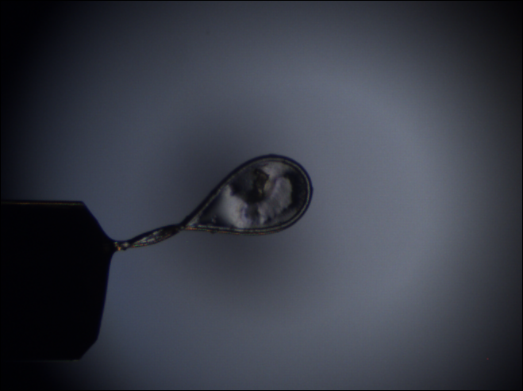

Introduction to LµCID library
=============================

The LUCID library (Loops and "`Micro`" Crytals IDentifier) provides some tools and methods for specific image processing tasks.

It was created to work on loops and crystals on beem lines.

One feature has been implemented yet:

- Tools for loop centering

